# 🦉 Trilha da Multiplicação

Aplicação desktop **gamificada** para ajudar crianças do Ensino Fundamental I a aprender a operação de multiplicação, brincando.

Este projeto nasceu do meu Trabalho de Graduação (TG), *"O uso das TICs no ensino da operação matemática da multiplicação para alunos do Ensino Fundamental I"*, que investigou como a gamificação pode tornar o aprendizado da matemática mais divertido e engajante — e agora está ganhando uma versão desktop nova, construída do zero.

Todo o backend — autenticação, progresso, ranking e conquistas — é fornecido pela **[Trilha da Multiplicação API](https://github.com/WelberC1/TrilhaDaMultiplicacaoAPI)**, um projeto ASP.NET Core separado. É essa API que este app roda contra; sem ela, o desktop não sobe.

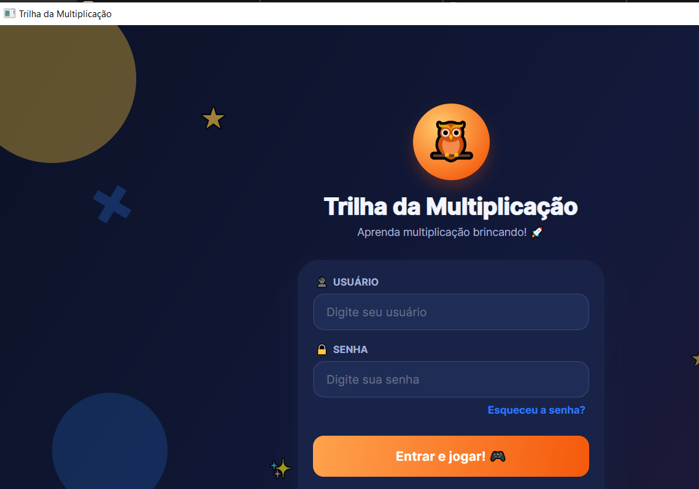

## 📖 Sobre o projeto

A pesquisa que originou este projeto mostrou que a gamificação — pontuação, ranqueamento, progressão em fases e a liberdade de errar sem punição — ajuda a quebrar o paradigma de que matemática é uma disciplina difícil e chata, aumentando o engajamento e o desempenho dos alunos.

A paleta de cores da interface também não foi escolhida por acaso: segue a psicologia das cores estudada no TG — **azul** para transmitir calma, **laranja** e **vermelho** para estimular energia e ação, e **amarelo** para alegria e estímulo intelectual.

## ✨ O que já existe

- **Login, cadastro e recuperação de senha** ilustrados e animados, pensados para o público infantil.
- **Trilha de fases navegável de verdade**, com progressão sequencial, estrelas por fase e barra de progresso — 12 fases ao todo, em duas rodadas de dificuldade crescente que repetem os 6 tipos de desafio (veja abaixo) em versões mais avançadas.
- **Casca de navegação por abas** depois do login: 🗺️ Trilha, 🏆 Ranking, 🎖️ Conquistas e 👤 Conta, com barra fixa mostrando avatar, nome e pontos.
- **Sistema de pontos** que soma a cada fase concluída e alimenta o ranking.
- **Ranking** com o aluno destacado entre outros exploradores, vindo de verdade da API.
- **Conquistas** desbloqueadas automaticamente conforme o progresso.
- **Conta do aluno**: editar nome e e-mail, escolher avatar entre ícones de bichinhos fofos, e trocar senha.

## 📸 Capturas de tela

**Criar conta.** Cadastro rápido com nome, usuário, e-mail e senha, na mesma linguagem visual lúdica do login.

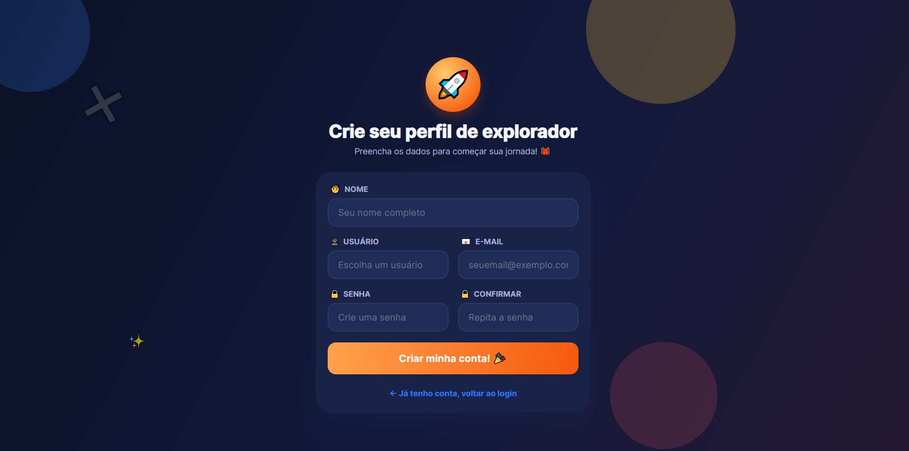

**Recuperar senha — passo 1.** O aluno (ou responsável) informa o e-mail cadastrado para receber o código de recuperação.

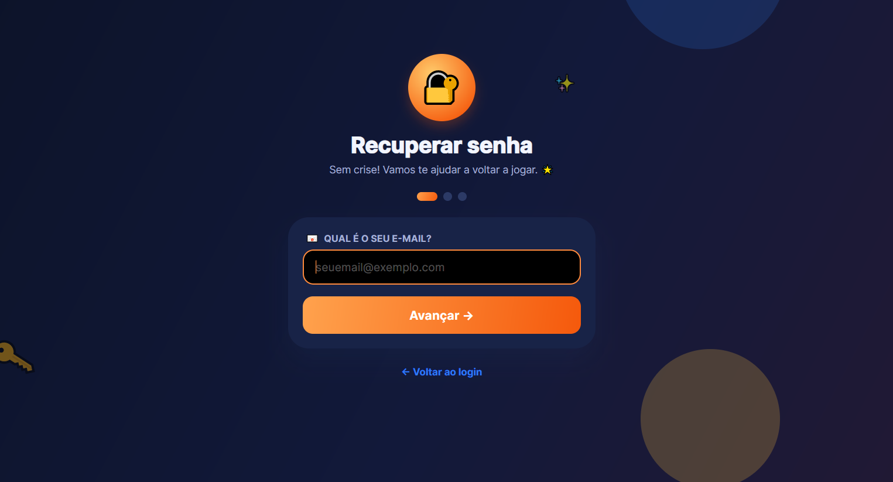

**Recuperar senha — passo 2.** Código de 6 dígitos enviado por e-mail, válido por 15 minutos.

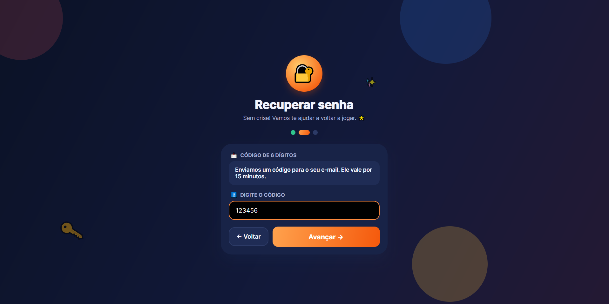

**Recuperar senha — passo 3.** Com o código validado, é só escolher a nova senha.

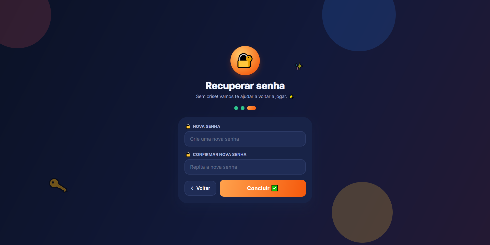

**Trilha de fases.** O mapa principal: fases desbloqueiam em sequência, cada uma mostra as estrelas já conquistadas, e dá pra rejogar qualquer fase concluída livremente.

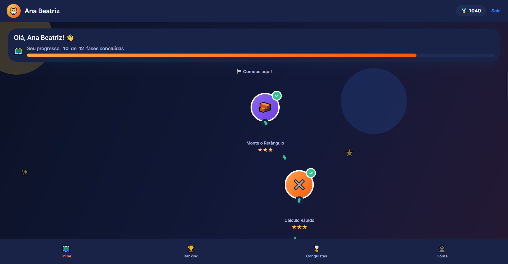

**Ranking.** Todos os alunos cadastrados, ordenados por pontos, com o aluno atual destacado em laranja.

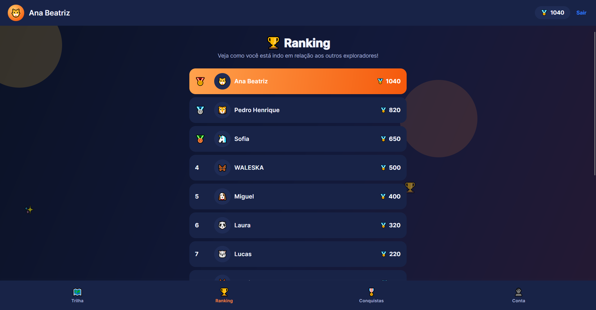

**Conquistas.** Desbloqueadas automaticamente por marcos de progresso (fases concluídas, estrelas máximas, pontos acumulados).

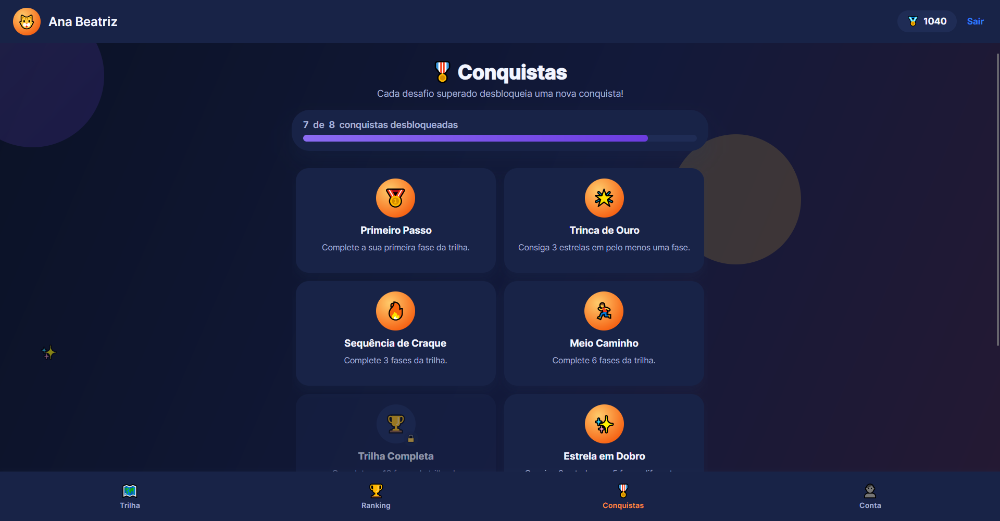

**Minha conta.** Editar nome, e-mail, escolher avatar entre os bichinhos disponíveis, e trocar senha.

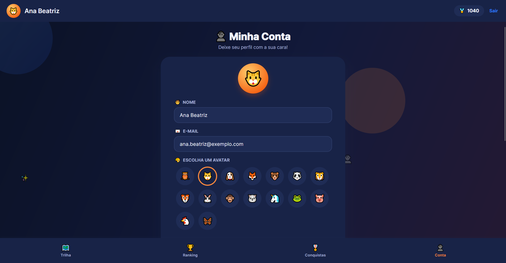

## 🎮 Os mini-jogos e seus objetivos

Cada um dos 6 tipos de desafio ataca a multiplicação por um ângulo pedagógico diferente — a ideia, vinda da pesquisa do TG, é que variar a *forma* de praticar a mesma operação mantém o engajamento e reforça a compreensão por caminhos diferentes (visual, memória, lógica, interpretação de texto, cálculo puro).

**🧱 Monte o Retângulo.** Modelo visual de array (linhas × colunas): o aluno monta um retângulo ajustando quantas linhas e colunas ele tem até bater com a conta pedida. Reforça *por que* a multiplicação funciona — é área, não só um resultado decorado.

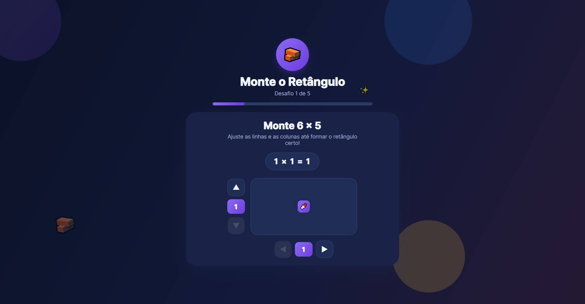

**✖️ Cálculo Rápido.** Contas de multiplicação contra o relógio, com alternativas de resposta. Trabalha fluência e velocidade de cálculo mental depois que o conceito já foi entendido nos outros jogos.

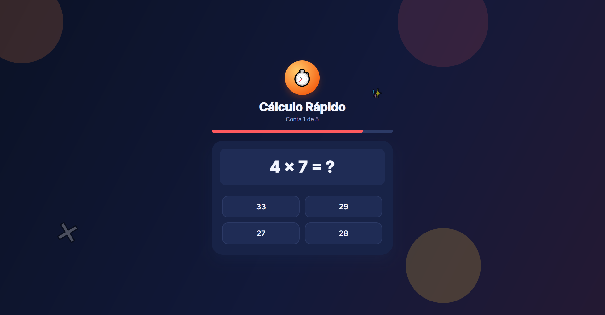

**🧠 Memória Numérica.** Jogo da memória combinando cada conta (`5 × 5`) com o resultado dela (`25`) — os pares ficam na mesma cor assim que revelados, reforçando a associação visual. Tem uma prévia cronometrada mostrando todas as cartas antes de embaralhar, pra estimular a memorização ativa.

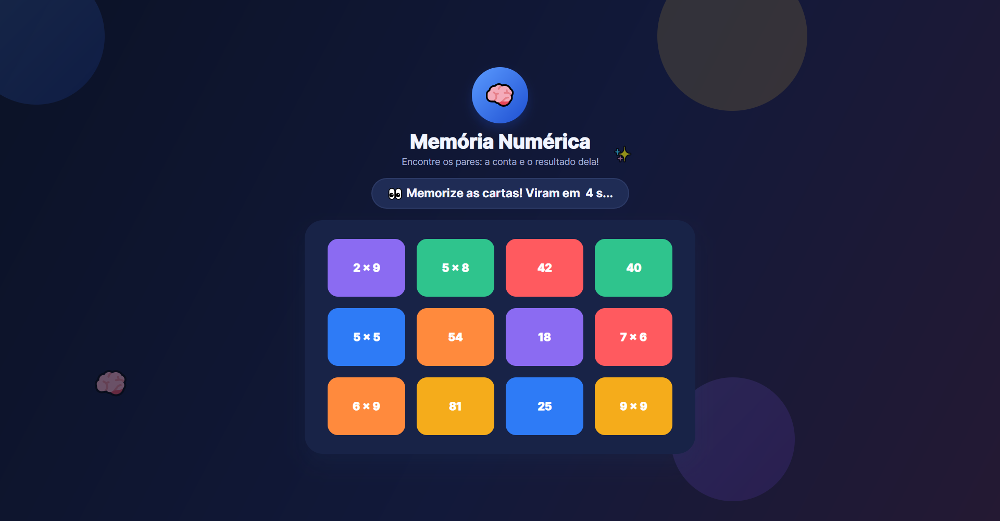

**📖 Ajude o Joãozinho.** Problemas de interpretação de texto ("Joãozinho tem 4 caixas de 6 lápis..."), pra treinar reconhecer quando e como aplicar a multiplicação em situações do dia a dia, não só resolver uma conta já pronta.

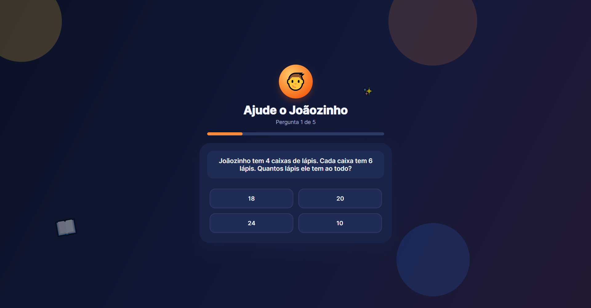

**🔍 Adivinhe o Multiplicando.** Descobre o fator que falta (`? × 4 = 32`). Inverte o raciocínio de "calcular o resultado" para "descobrir uma peça que falta", preparando terreno pra divisão mais adiante.

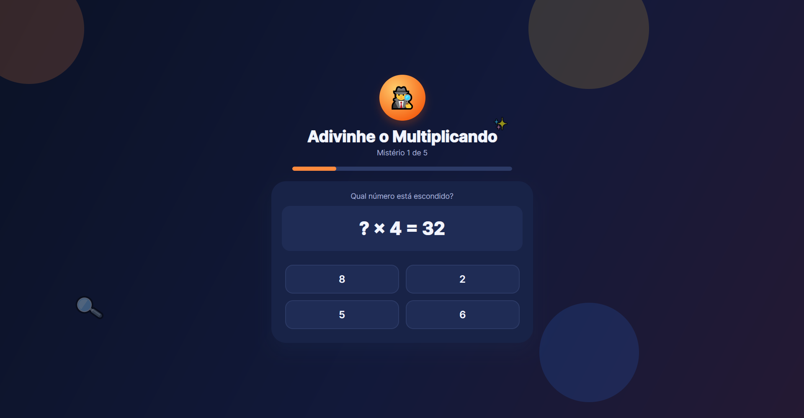

**🧩 Certo ou Errado?** Julga afirmações verdadeiro/falso — contas, comparações entre produtos e propriedades da multiplicação (comutatividade, etc.). Treina julgamento crítico e verificação, em vez de só executar contas.

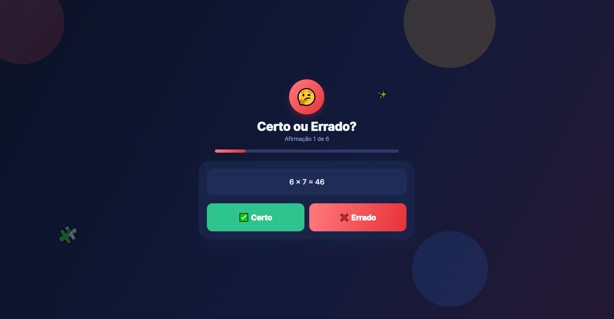

## 🛠️ Tecnologias

**Desktop (este projeto)**

- [.NET 10](https://dotnet.microsoft.com/)
- [Avalonia UI](https://avaloniaui.net/) 12 (multiplataforma: Windows, Linux, macOS)
- [CommunityToolkit.Mvvm](https://learn.microsoft.com/dotnet/communitytoolkit/mvvm/) — padrão MVVM
- Injeção de dependência via `Microsoft.Extensions.DependencyInjection`

**Backend — [Trilha da Multiplicação API](https://github.com/WelberC1/TrilhaDaMultiplicacaoAPI)**

- [.NET 10](https://dotnet.microsoft.com/) / ASP.NET Core
- [Entity Framework Core](https://learn.microsoft.com/ef/core/) + SQL Server
- Autenticação via JWT (`Microsoft.AspNetCore.Authentication.JwtBearer`), com refresh token e rate limiting nas rotas de login/cadastro
- [BCrypt.Net](https://github.com/BcryptNet/bcrypt.net) para hash de senha
- [MailKit](https://github.com/jstedfast/MailKit) para envio de e-mail (recuperação de senha)

## 🚀 Como rodar

Pré-requisitos: [.NET 10 SDK](https://dotnet.microsoft.com/download) e a **[Trilha da Multiplicação API](https://github.com/WelberC1/TrilhaDaMultiplicacaoAPI)** rodando localmente em `http://localhost:5271` (siga o "Como rodar" do repositório dela primeiro — precisa de SQL Server e uma chave JWT configurada). Sem a API no ar, o app abre mas não consegue logar nem cadastrar.

```bash
git clone https://github.com/WelberC1/TrilhaDaMultiplicacao.Desktop.git
cd TrilhaDaMultiplicacao.Desktop
dotnet run --project TrilhaDaMultiplicacao.Desktop
```

## 📁 Estrutura do projeto

```
TrilhaDaMultiplicacao.Desktop/
├── Views/          # Telas (XAML) — trilha, mini-jogos, abas e casca de navegação
├── ViewModels/      # Lógica de apresentação (MVVM)
├── Models/           # Modelos de fase, perguntas dos jogos, ranking, conquistas etc.
├── Services/          # Navegação, sessão do aluno e progresso (IProgressoRepository)
├── Styles/             # Paleta de cores e estilos dos componentes
└── Assets/              # Imagens e ícones
```

`SessionService` implementa `IProgressoRepository` e fala de verdade com o [backend](https://github.com/WelberC1/TrilhaDaMultiplicacaoAPI) — login, cadastro, progresso, ranking e conquistas são todos persistidos na API. Dentro do processo, a sessão (token, refresh token e perfil) fica só em memória: fechar o app exige logar de novo.

## 🎓 Contexto acadêmico

Projeto pessoal de continuidade do TG apresentado por **Welber Caetano Santos**, sobre o uso de tecnologias da informação e gamificação no ensino da multiplicação para alunos do Ensino Fundamental I.
